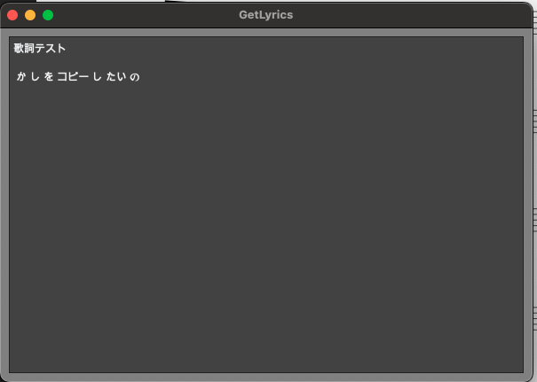

# Get lyrics plugin for MuseScore

Is it just me?
Strangely, even when I copy all the lyrics in MuseScore, I can't paste them into other text editors.  
This plugin displays the lyrics from the open score in a text area.  
This way, you can edit the lyrics in your favorite editor.

私の環境だけなのか分かりませんが、Musescoreは歌詞全体をコピーしても他のテキストエディタに貼り付けることができません。  
このプラグインは開いている楽譜の歌詞をテキストエリアに表示させるものです。  
これで自分の好きなエディタで歌詞を編集できます。

